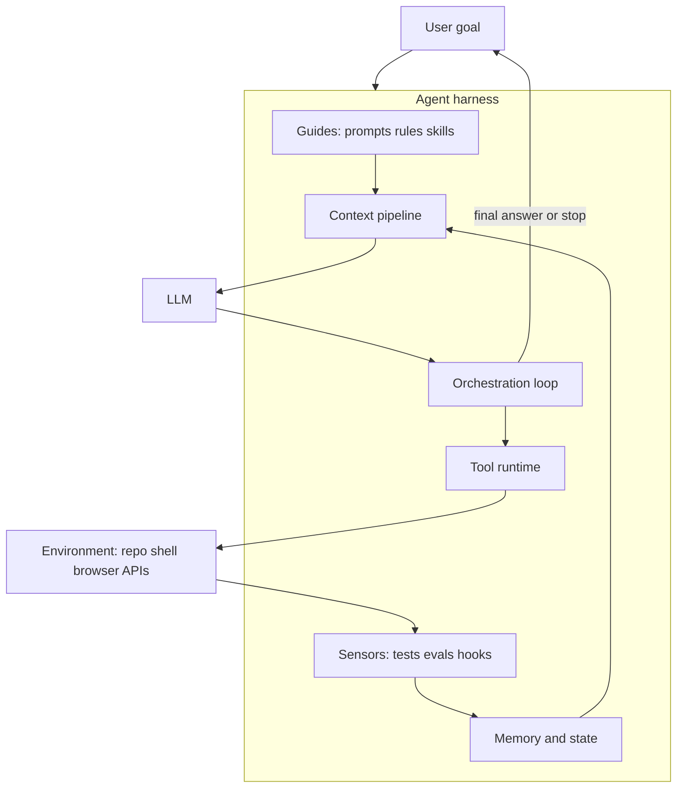
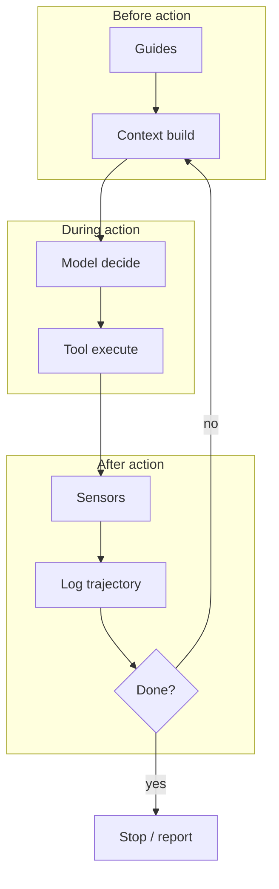
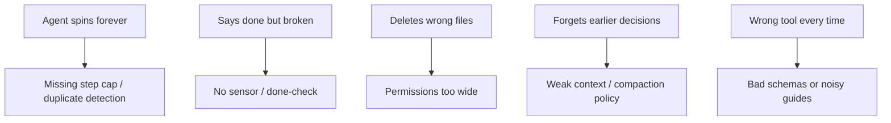

+++
title = 'Model Plus Scaffolding: Building the Runtime Around an LLM'
date = '2026-07-23T14:00:00+05:30'
draft = false
description = 'What agent harnessing (harness engineering) is, how it differs from prompt engineering, the core layers of a harness, and how products like Cursor put one around the model.'
tags = ['AI', 'Agents', 'Harness Engineering', 'Agent Loop', 'Engineering']
categories = ['AI', 'Engineering']
summary = 'Agent = Model + Harness. Harnessing is the craft of building tools, loops, sandboxes, sensors, and guardrails so an LLM can finish real work safely.'
+++


*We spent years arguing about which model is smartest. Production teams are learning a harder lesson: the model is only half the system.*

**Agent harnessing** (also called **harness engineering**) is the practice of designing everything *around* an LLM so it can plan, act, observe, recover, and stop - reliably.

The short formula:

> **Agent = Model + Harness**

If you are not shipping model weights, you are building the harness.

This sits next to earlier posts on [AI agents](/posts/ai-agents/), the [agent loop](/posts/agent-loop/), [skills](/posts/agent-skills/), and [context windows](/posts/context-windows/). Those explain pieces. Harnessing is the name for assembling them into a runtime.

---

## What is an agent harness?

An **agent harness** is the runtime layer between:

1. the **model** (proposes text / tool calls), and  
2. the **environment** (files, shells, browsers, APIs, tickets)

It is the software that:

- builds context for each turn  
- runs the [agent loop](/posts/agent-loop/)  
- executes tools (and refuses unsafe ones)  
- stores / retrieves memory  
- checks results (tests, parsers, evals)  
- enforces budgets, approvals, and stop conditions  
- logs trajectories so you can debug what happened  

A raw chat completion API is not a harness. Cursor Agent, Claude Code, Codex-style coding agents, and custom LangGraph/OpenAI Agents SDK apps *are* harnesses (with different opinions).



---

## Why "harness"?

In software testing, a **test harness** is the scaffolding that drives code under test: fixtures, runners, assertions, isolation.

An **agent harness** plays the same role for a probabilistic model:

| Testing harness | Agent harness |
|-----------------|---------------|
| Invokes the unit under test | Invokes the model each turn |
| Provides fixtures / mocks | Provides tools + sandbox |
| Asserts outputs | Sensors / evals / done-checks |
| Isolates side effects | Permissions + approvals |
| Records failures | Trajectory logs / traces |

Without a harness, you have a smart autocomplete box. With a harness, you have something that can change a repo and prove the change worked.

---

## Prompt engineering vs harness engineering


| | Prompt engineering | Harness engineering |
|--|--------------------|---------------------|
| Scope | One interaction | Many steps over time |
| Lever | Wording, examples | Tools, sensors, policy, loop |
| Failure mode | Bad answer | Bad *system behavior* (loops, unsafe actions, silent wrong "done") |
| Owner | Often a prompt author | Platform / product engineers |

Prompting still matters. It is one **guide** inside the harness - not the whole discipline.

Context engineering (what enters the window) is also inside the harness. See [context windows](/posts/context-windows/).

---

## Core layers of a harness


A useful taxonomy (guides vs sensors shows up a lot in 2026 harness writing):

### 1. Guides (feedforward)

Steer the agent *before* it acts:

- system prompts, `AGENTS.md`, Cursor rules  
- [agent skills](/posts/agent-skills/)  
- tool schemas and descriptions  
- allow / deny policies  

### 2. Actuators (tools)

Make effects in the world:

- read/edit files, shell, browser  
- MCP servers, internal APIs  
- ticket / deploy / data connectors  

Smaller, well-described action spaces beat huge vague ones.

### 3. Sensors (feedback)

Validate *after* it acts:

- unit/integration tests, typecheckers, linters  
- output parsers / schema validation  
- eval suites and graders  
- hooks: post-edit format, pre-commit checks  

Sensors are how you stop trusting "looks good to me."

### 4. Control plane

Keep the loop honest:

- step / token / time / cost budgets  
- duplicate-tool-call detection  
- human approval gates  
- interrupt / resume / compaction  
- model routing (cheap model for triage, strong model for hard steps)

### 5. Context + memory

- working transcript (trajectory)  
- retrieval over docs/code  
- durable preferences / project memory  
- compaction when the window fills  

### 6. Sandbox + observability

- filesystem / network isolation  
- secrets handling  
- traces, cost meters, replayable logs  



---

## A minimal harness in pseudocode

This is the same skeleton as the [agent loop](/posts/agent-loop/) post - named as a harness:

```python
def run_harness(goal, model, tools, sensors, policy, limits):
    state = new_state(goal)
    while not state.done and state.steps < limits.max_steps:
        context = build_context(state, policy.guides)
        decision = model.decide(context, tools.schemas)

        if decision.is_final:
            if sensors.accept_final(decision, state):
                return success(decision)
            state.observe("final rejected by sensor")
            continue

        if not policy.allows(decision):
            state.observe("blocked by policy")
            continue

        result = tools.run(decision)          # actuator
        verdict = sensors.check(result, state)  # feedback
        state.append(decision, result, verdict)
        state.maybe_compact(limits.context)

    return fail(state.reason)
```

Swap models freely. The harness is the product.

---

## What good harnessing looks like in practice

### Coding agents (Cursor-class)

| Harness piece | Example |
|---------------|---------|
| Guides | rules, skills, system prompt |
| Actuators | read/edit, grep, terminal, browser, MCP |
| Sensors | tests you ask it to run; linters; CI |
| Control | step budgets, ask-to-overwrite, mode switches |
| Context | index + `@` files + open editors |
| Sandbox | workspace boundaries, ignore files |

When Cursor "feels smart," you are often feeling a strong harness (retrieval + tools + loop), not only a bigger model.

### Chat assistants with tools

Same idea, softer environment: browsing, code interpreter, file uploads, memory. Compaction and memory features are harness concerns.

### Your own product agent

Do not start by fine-tuning. Start by:

1. tiny tool set  
2. explicit done-check  
3. hard budgets  
4. logged trajectories  
5. one eval suite you run on every harness change  

Evaluate **model + harness pairs**. A harness change can beat a model upgrade.

---

## Failure modes are usually harness bugs



Blame the model last. Ask:

- What guides were loaded?  
- What did the tool actually return?  
- Which sensor ran?  
- What stop condition fired?

That debugging habit is harness literacy.

---

## Practical checklist: harness v0

1. **Goal format** - observable success criteria  
2. **Tool allowlist** - least privilege  
3. **Loop** - reason / act / observe with max steps  
4. **Sensors** - at least one external check (tests, query, schema)  
5. **Human gate** - for irreversible actions  
6. **Logging** - full trajectory to disk  
7. **Eval set** - 10-50 tasks you re-run when you change prompts/tools  
8. **Compaction policy** - what survives when context fills  

Ship that before multi-agent graphs and exotic planners.

---

## Closing

**Agent harnessing** means treating the scaffolding as a first-class product:

> the model proposes; the harness constrains, executes, verifies, and stops.

Strong harnesses make average models useful. Weak harnesses waste frontier models - and create scary demos.

If you only remember one line:

> **Stop asking only "which model?" Start asking "what harness wraps it?"**

**Next step:** take one workflow you already trust an agent with. Draw its guides, tools, sensors, and stop conditions. That diagram *is* your harness map - and Mermaid is now enabled on this blog for exactly that kind of sketch.
