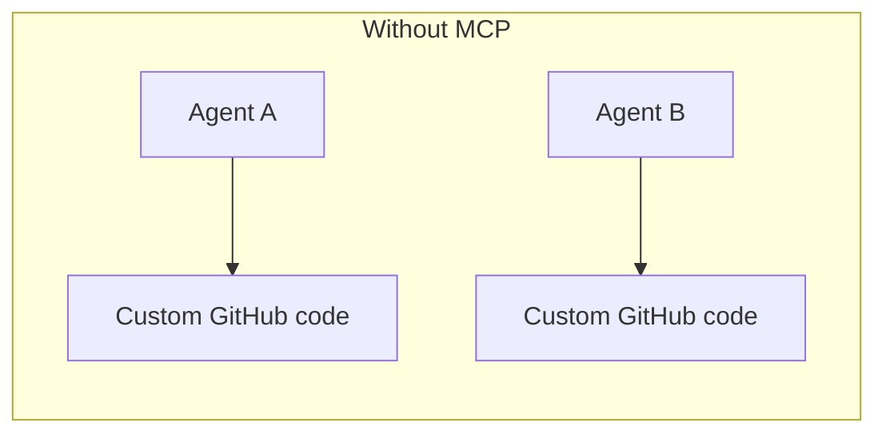
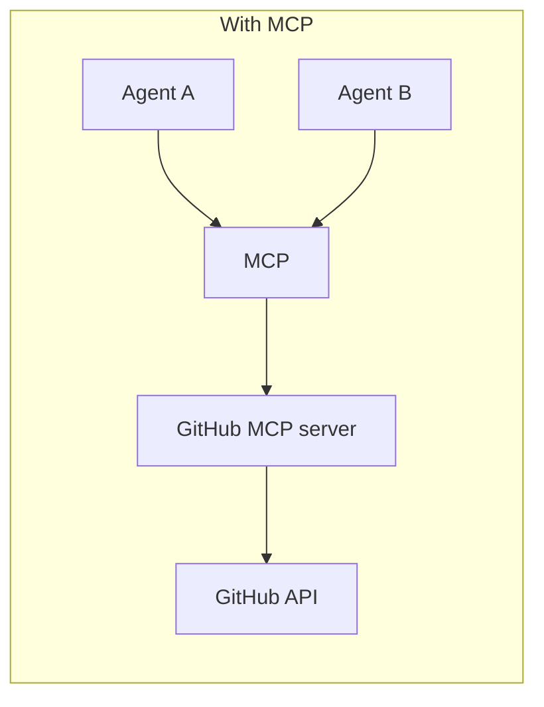
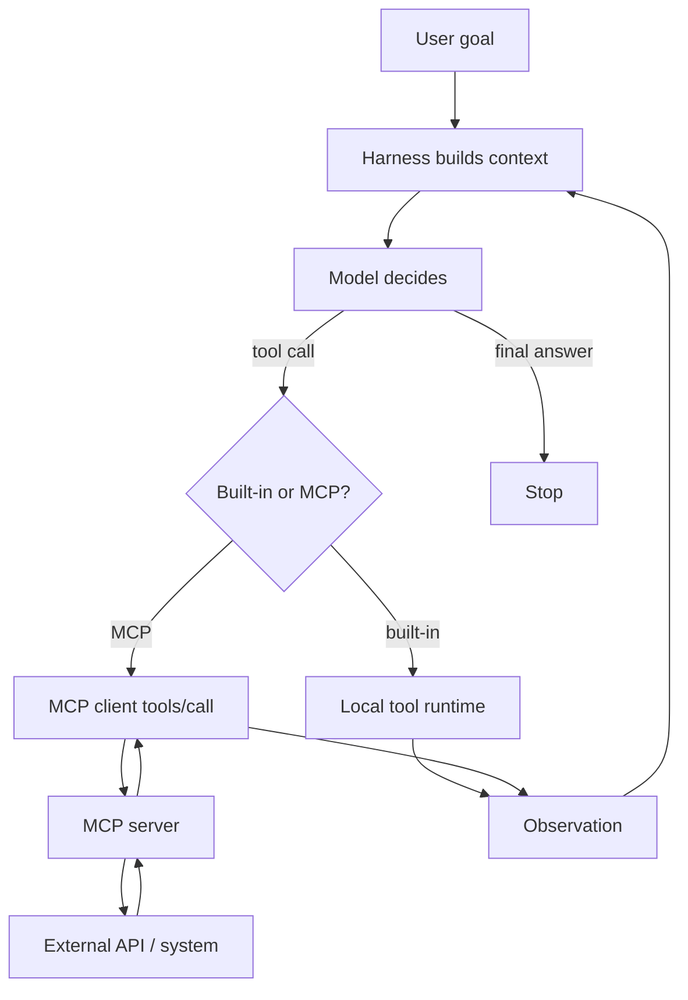

+++
title = 'Plug the World In: How Agents Turn MCP into Tools'
date = '2026-07-22T15:00:00+05:30'
draft = false
description = 'What the Model Context Protocol is, how MCP servers expose tools, and how agent harnesses discover and call those tools inside the agent loop.'
tags = ['AI', 'MCP', 'Agents', 'Tools', 'Cursor', 'Engineering']
categories = ['AI', 'Engineering']
summary = 'MCP is a standard plug for agent tools. Servers expose capabilities; the harness lists them, the model chooses, and tools/call executes - inside the same agent loop.'
+++


*Built-in tools are finite. The world of APIs is not. MCP is how agents plug into that world without a custom integration for every product.*

If [agent harnessing](/posts/agent-harness/) is the runtime around the model, **MCP (Model Context Protocol)** is one of the cleanest ways that runtime gets *new hands*.

This post covers:

1. What MCP is  
2. Host, client, server  
3. Tools vs resources vs prompts  
4. How agents use MCP **as tools** inside the loop  
5. Where it fits with skills, harnesses, and context windows  

---

## The problem MCP solves

Before a shared protocol, every AI product reinvented connectors:

- one GitHub integration for Assistant A  
- another for IDE B  
- a third for your internal agent  

That does not scale. Tool providers want to ship **one** adapter. Agent products want to **discover** capabilities at runtime.

MCP is an open standard for that handshake - often described as "USB for AI tools."





---

## Core pieces

| Piece | Role |
|-------|------|
| **Host** | The AI app the user uses (Cursor, Claude Desktop, your agent product) |
| **MCP client** | Lives inside the host; speaks the protocol to servers |
| **MCP server** | Exposes tools / resources / prompts for one domain |
| **Transport** | How they talk (local stdio process, or remote HTTP/SSE-style endpoints) |

The **model never speaks MCP directly**. The [harness](/posts/agent-harness/) does: it lists tools, offers them to the model as function-calling schemas, then routes chosen calls to the right MCP server.


### Tools (what agents use most)

Executable actions with JSON schemas:

- `create_issue`  
- `query_database`  
- `get_figma_node`  

**Model-controlled:** the LLM decides when to call them (often with human approval for sensitive ones).

Discovery: `tools/list`  
Invocation: `tools/call`

### Resources

Readable data the **application** may load into context (files, schemas, docs). Closer to RAG inputs than to actions.

### Prompts

Reusable templates the **user** picks (guided workflows / slash-style commands).

For this post we focus on **tools**, because that is how MCP shows up inside the [agent loop](/posts/agent-loop/).

---

## How agents use MCP as tools (sequence)


### Step 1 - Connect

On startup (or when you enable a server), the host opens an MCP client session to each configured server.

Examples in Cursor-like products: Figma, databases, internal APIs, browser bridges - each is a server entry in config.

### Step 2 - Discover

The client calls **`tools/list`**. Each tool comes back with:

- `name`  
- `description` (critical for the model)  
- `inputSchema` (JSON Schema for arguments)

Servers can later send `notifications/tools/list_changed` if the catalog updates.

### Step 3 - Register into the harness toolbelt

The host merges MCP tools with built-in tools (read file, shell, …) into one list the model can see.

From the model's point of view there is little difference:

```text
built-in: read_file(path)
mcp:      github.create_pull_request(title, body, head, base)
```

Both are just **tools with schemas**.

### Step 4 - Reason inside the loop

User goal arrives. The [agent loop](/posts/agent-loop/) runs:

1. Model sees goal + tool schemas (+ context)  
2. Model emits a tool call (name + args)  
3. Harness validates policy / approvals  
4. If the tool is MCP-backed, client sends **`tools/call`**  
5. Server executes against the real API  
6. Result returns as an **observation**  
7. Loop continues until done  



That is the whole story: **MCP does not replace the agent loop. It feeds the loop's action space.**

---

## A concrete walkthrough

Goal: *"Open a PR that fixes the flaky auth test."*

| Step | Actor | What happens |
|------|-------|--------------|
| 1 | Harness | Lists built-ins + `github.*` MCP tools |
| 2 | Model | `read_file` / search locally (built-in) |
| 3 | Model | edits code (built-in) |
| 4 | Model | `run_tests` (built-in or MCP) |
| 5 | Model | `create_pull_request(...)` via MCP |
| 6 | Server | Calls GitHub API, returns PR URL |
| 7 | Model | Final answer with the link |

MCP mattered only at the GitHub edge. The loop, budgets, and sensors still belong to your harness.

---

## MCP vs skills vs built-in tools

| Concept | What it is | When it loads |
|---------|------------|---------------|
| **Built-in tools** | Host-native actions | Always part of the product |
| **MCP tools** | Actions from external servers | When that server is connected |
| **[Skills](/posts/agent-skills/)** | Playbooks / procedures | When the task matches a skill |

Skills tell the agent *how* to work a workflow.  
MCP gives the agent *new verbs* to call.  
They compose: a skill might say "use the Figma MCP tools to pull tokens, then update CSS."

---

## Why descriptions and schemas matter

Bad MCP tools create bad agents:

- vague `description` -> model never calls or calls wrongly  
- loose schemas -> invalid args  
- huge unstructured blobs in results -> [context window](/posts/context-windows/) blow-ups  

Good server design:

1. One tool, one job  
2. Precise descriptions with trigger phrases  
3. Strict input schemas  
4. Structured, truncated errors the model can recover from  
5. Least-privilege auth on the server side  

The harness should still enforce approvals for destructive tools (`delete_*`, payments, production deploys).

---

## Security and trust boundaries

MCP expands the blast radius. Treat servers like installed plugins:

- Only enable servers you trust  
- Prefer read-only tokens when possible  
- Require human confirmation for writes  
- Log every `tools/call` in the trajectory  
- Do not paste secrets into tool args; use server-side credentials  

Remember: the model proposes the call; **your client executes it**. Policy belongs in the harness.

---

## Where MCP sits in this blog's AI sequence

Learning order:

1. [Inside the Next Token](/posts/understanding-llms/) - the engine  
2. [From Chatbot to Agent](/posts/ai-agents/) - vocabulary  
3. [Reason, Act, Observe](/posts/agent-loop/) - the control loop  
4. **MCP (this post)** - standard plugs that expand the toolbelt  
5. [The Token Budget](/posts/context-windows/) - context limits  
6. [On-Demand Playbooks](/posts/agent-skills/) - skills  
7. [Model Plus Scaffolding](/posts/agent-harness/) - the full runtime  

---

## Practical checklist

1. Start with **one** MCP server that solves a real pain  
2. Verify `tools/list` returns clear names + schemas  
3. Watch one full trajectory: model call -> `tools/call` -> observation  
4. Add approval gates for write tools  
5. Cap result size before it hits the context window  
6. Add a sensor (test / API read-back) so "done" is verified  

---

## Closing

**MCP** standardizes how agent hosts discover and invoke external capabilities.

For agents, the important mental model is simple:

> MCP servers publish tools. The harness registers them. The model selects them. `tools/call` executes them. Observations re-enter the loop.

It is not magic autonomy. It is a **tool transport** - and in production, transport plus policy plus sensors is what makes agents useful.

**Next step:** enable one MCP server in your agent host, ask `what tools do you have from that server?`, then run a single safe read-only call and inspect the observation. That exercise teaches more than another abstract diagram.
